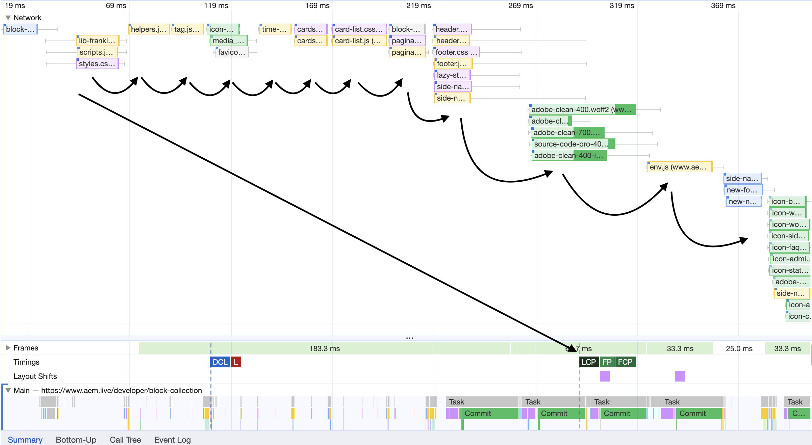
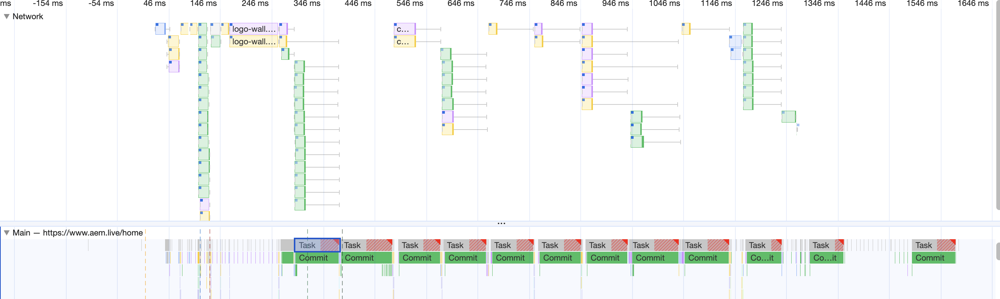

# Edge Perfomance

As it states

```
If you start your project with the Boilerplate as in the Developer Tutorial, you will get a very stable Lighthouse score that is 100. On every component of the lighthouse score there is some buffer for the project code to use and still be within the boundaries of a perfect 100 score.
```

Main point to focus here is
Please check
[Three-Phase Loading](https://www.aem.live/developer/keeping-it-100#three-phase-loading-e-l-d)

Edge defines as 3 fases

- Phase E (Eager): This contains everything that's needed to get to the largest contentful paint (LCP).
- Phase L (Lazy): This contains everything that is controlled by the project and largely served from the same origin.
- Phase D (Delayed): This contains everything else such as third-party tags or assets that are not material to experience.

The good:

1. LCP Blocks
2. Proper Eager first LCP image.
3. Deliver minimal for LCP
4. Font fallback plugin

The bad:

1. Header
2. no mention of preloading
3. fixed code required to configure LCP_BLOCKS

The ugly

1. Queue / Priorization with async await code

# Good

## LCP blocks

One great point is to be able to configure what blocks represents LCP

```javascript
// at their script they allow a LCP_BLOCKS
const LCP_BLOCKS = ['hero', 'logo-wall'];
```

## Eager first LCP image

Althoult backend renders first image as `loading="lazy"` they transform it to `loading="eager"` at blocking level
Kepping it as good as it were preloaded.

## fonts

They offer a plugin to proper check and setup custom fonts to avoid CLS [font fallback plugin](https://www.aem.live/developer/font-fallback)

# Bad

## header

although they enforce that header is not LCP, that definetly is the case in several henkel sites where logo is the main LCP or header impacts CLS. So a non priorized header can easily impact CLS and some cases even LCP

## Some assets could be preloaded.

In some cases preload some assets would offer advantages on LCP and FP

## fixed code required to configure LCP_BLOCKS

That also can be a issue if you have diferent blocks on diferent pages

# the ugly

Well althould is actually a well performing script, it's relying a lot on queue and async await.

- Async function if you actually await became basicly syncronous code.

Queue will always offer a step by step loading and reduce the concurrency increasing the time to load overrall and can lead to longer load times.

## This repo on OOB script on regular wifi network no CDN


## This repo on OOB script on slow 3G


get's clear the async await / queue impact

## At netcentric.biz


## At aem.live



