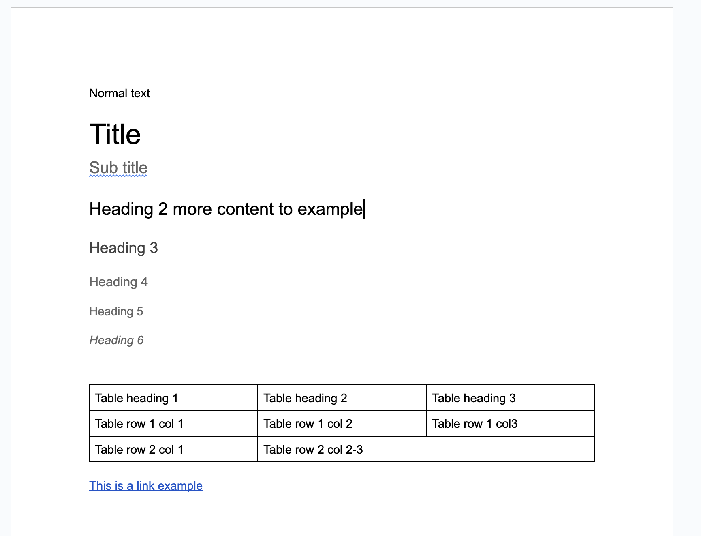

# Edge Delivery Server Rendering

In this section, we will briefly discuss the current Edge Delivery Boilerplate/Out of the Box (OOB) methods and rationale for improvement.

## Advantages

- Simple document-based authoring
- Fast server-side delivery

## Simple Document-based Authoring

This can be summarized into two key aspects:

- Converting documents into HTML
- Transforming Excel/spreadsheets into JSON

This approach provides a clean and straightforward method for generating HTML and JSON based on documents and document trees.

### Docs into HTML - Server-side Render

A sample doc file with an example text will be rendered into the following HTML:

```HTML
<!doctype html>
<html>
  <head>
    <title>Name of the document</title>
      <!--
        content of meta tags and open graph tags
       -->
    <meta name="viewport" content="width=device-width, initial-scale=1" />
    <script src="/scripts/lib-franklin.js" type="module"></script>
    <script src="/scripts/scripts.js" type="module"></script>
    <link rel="stylesheet" href="/styles/styles.css" />
  </head>
  <body>
    <header></header>
    <main>
      <!--
        content of the document
       -->
    </main>
    <footer></footer>
  </body>
</html>
```

The document content will be transformed into the corresponding HTML structure as shown below:

Example document:


Output:

```HTML
<div>
  <p>Normal text</p>
  <h1 id="title">Title</h1>
  <h3 id="sub-title">Sub title</h3>
  <h2 id="heading-2-more-content-to-example">
    Heading 2 more content to example
  </h2>
  <h3 id="heading-3">Heading 3</h3>
  <h4 id="heading-4">Heading 4</h4>
  <h5 id="heading-5">Heading 5</h5>
  <h6 id="heading-6">Heading 6</h6>
  <div class="table-heading-1">
    <div>
      <div>Table row 1 col 1</div>
      <div>Table row 1 col 2</div>
      <div>Table row 1 col3</div>
    </div>
    <div>
      <div>Table row 2 col 1</div>
      <div>Table row 2 col 2-3</div>
    </div>
  </div>
  <p>
    <a href="https://www.w3schools.com/html/html_links.asp">This is a link example</a>
  </p>
</div>
```

Server-side rendering follows these rules:

1. Titles are formatted as H1.
2. Subtitles are formatted as H3.
3. All other headings follow the proper name-element correlation.
4. Headings are assigned an ID based on their content.
5. Tables will render with only one header as a class name in lowercase, dash-separated.
6. Table rows will create one div per column.
7. Tables will be rendered as `<table>` only when inside another table.
8. A div can be wrapped by adding `---` into the document.
9. Break lines are represented as `<p>`.
10. Links are generally wrapped in `<p>` tags and then enclosed within an `<a>`.

### Spreadsheets into JSON

Spreadsheet content is rendered into a simple JSON format as shown in the example:

```json
{
  "total": 3,
  "offset": 0,
  "limit": 3,
  "data": [
    {
      "propertyName1": "value 2A",
      "propertyName2": "value 2B",
      "propertyName3": "value 2C"
    },
    {
      "propertyName1": "value 3A",
      "propertyName2": "value 3B",
      "propertyName3": "value 3C"
    },
    {
      "propertyName1": "value 4A",
      "propertyName2": "",
      "propertyName3": "value 4C"
    }
  ],
  ":type": "sheet"
}
```

### OOB Exceptions

### Metadata and robots.txt

A spreadsheet named `metadata` will be rendered as HTML `<meta>` and define `robots.txt`.

For more details, refer to [Adobe Experience Manager Cloud Service Documentation](https://experienceleague.adobe.com/docs/experience-manager-cloud-service/content/edge-delivery/publish/authoring.html?lang=en).
