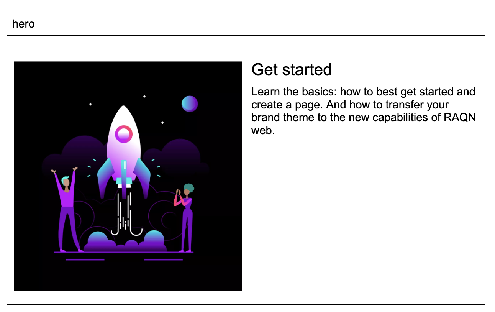
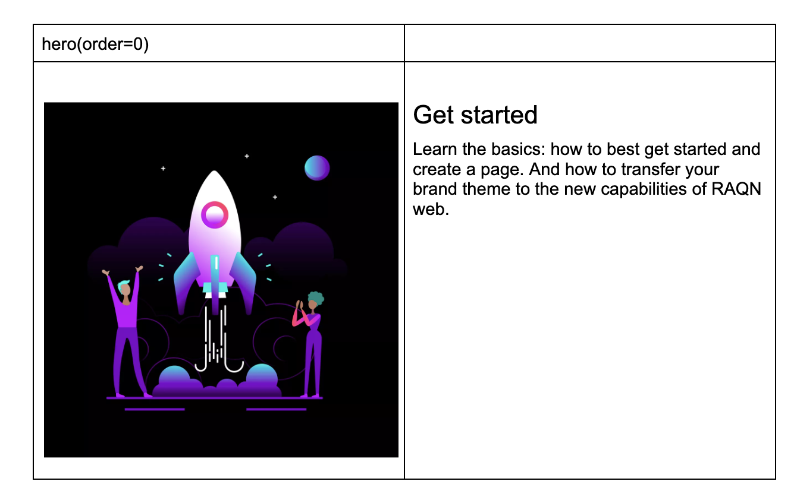
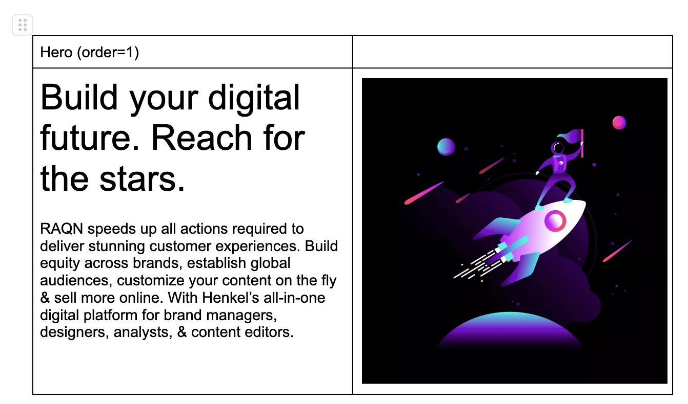
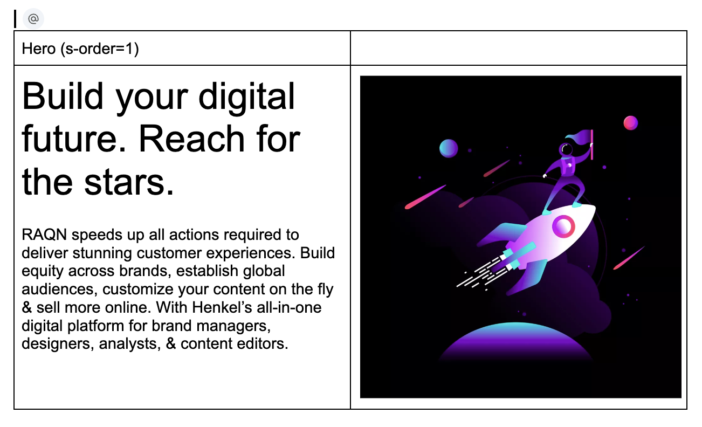

# Component Base

We want to be able to add features as reusable components instead of a composition of functions.

That allows us to:

1. Have a clear component life cicle
2. Enforce good code practices
3. Easy Reusability

## Simple component loader

Instead of several decoration functions we setup a simple component loader to "decorate and prepare"

It allows:

1. Still keep the "blocks" as functional scripts
2. Allow to use custom elements intead
3. Proper setup data and params from class intead of semantical content data.
4. Params can be setup per breakpoint

## Component loader

Component setup params and custom elements

Document example


Then with the example our component loader will:

1. Try to load a hero component or block
2. Will check if the loaded default has a name and not fn named decorate
3. Read and create element attributes based on class names
4. If not it will create a custom element based on the name of the component
5. if is a decorate function keep as EDS

## Base Custom Element Component

A standard use custom elements as our definition of a component

That will

1. Extends HTMLElement
2. Pre define some extra life cicle
   1. predefine `connectedCallback`
   2. Load a external content if `external` property exist
   3. Run Component loader on it's content if external
   4. Add a life cicle for process external html as `processExternal`
   5. Add a `connected` after previous setup and externals are loaded
   6. Add a ready life cicle to setup things everythings is ready.
3. Keep all other custom element features

here:
[component-base](../../scripts/component-base.js)

With component loader that will be rendered as:

```html
<raqn-hero id="gen629e56de">
  <div>
    <picture>
      <!-- ..... -->
    </picture>
  </div>
  <div>
    <h2 id="get-started-1">Get started</h2>
    <p>
      Learn the basics: how to best get started and create a page. And how to
      transfer your brand theme to the new capabilities of RAQN web.
    </p>
  </div>
</raqn-hero>
```

## Custom element example

So let's bring that custom element to life

Let's check this simple example

```javascript
import ComponentBase from '../../scripts/component-base.js';

export default class Hero extends ComponentBase {
  static observedAttributes = ['order'];

  ready() {
    this.order = this.getAttribute('order');
    // add some extra classes
    this.classList.add('full-width');
    this.setAttribute('role', 'banner');
    // setup a css variable
    this.style.setProperty('--hero-hero-order', this.getAttribute('order'));
  }
}
```

this example:
1 - Use the ready callback when the custom element is defined and added to the page.
2 - Setup some classe, attribute and set a css variable.

### Passing attributes to your component

Let's the use the document to pass the param



Then with this change you will pass a param to your component

```html
<raqn-hero order="0" id="gen58aa7c0c" class="full-width" role="banner">
  <div>
    <picture>
      <!-- ... -->
    </picture>
  </div>
  <div>
    <!-- ... -->
  </div>
</raqn-hero>
```

So let's add a little style at hero.css

```css
/* block specific CSS goes here */
raqn-hero {
  --hero-background-color: var(--scope-background, black);
  --hero-color: var(--scope-color, white);
  --hero-grid-template-columns: 0.6fr 0.4fr;
  --hero-hero-order: 0;

  background-color: var(--hero-background-color);
  color: var(--hero-color);
  align-items: center;
  grid-template-columns: var(--hero-grid-template-columns, 1fr);

  @media screen and (max-width: 768px) {
    --hero-grid-template-columns: 1fr;
  }

  & > div:first-child {
    order: var(--hero-hero-order);
  }
}
```

Now we should have something like
(Apart from theme definitions (see [theme](theme.md)))


### block changing the params



These change will:
1 - Set the param to 1
2 - Setting the variable order to css

them we'll see changes like:


## Setting Param only to a viewport

For setting a param only to a specific viewport just prefix with the viewport key

1. **s**: 0 to 767,
2. **m**: 768 to 1023,
3. **l**: 1024 to 1279,
4. **xl**: 1280 to 1919,
5. **xxl**: 1920,

So let's set the order param to apply only on S (0 to 767) viewport



Now the param is only set at S viewports


