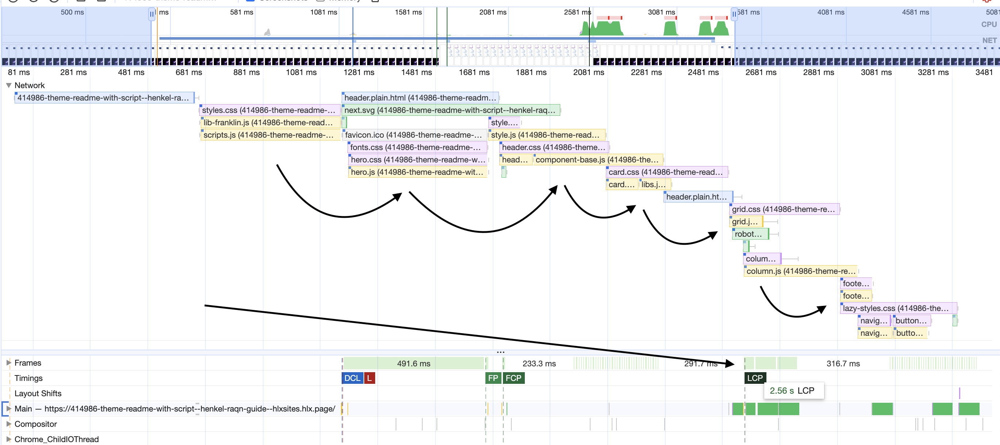
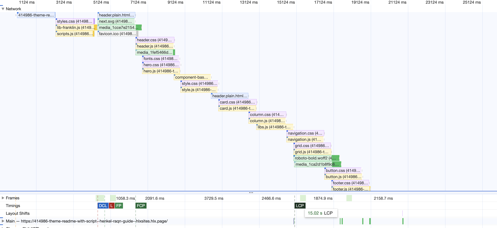
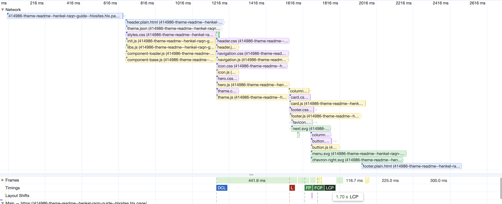
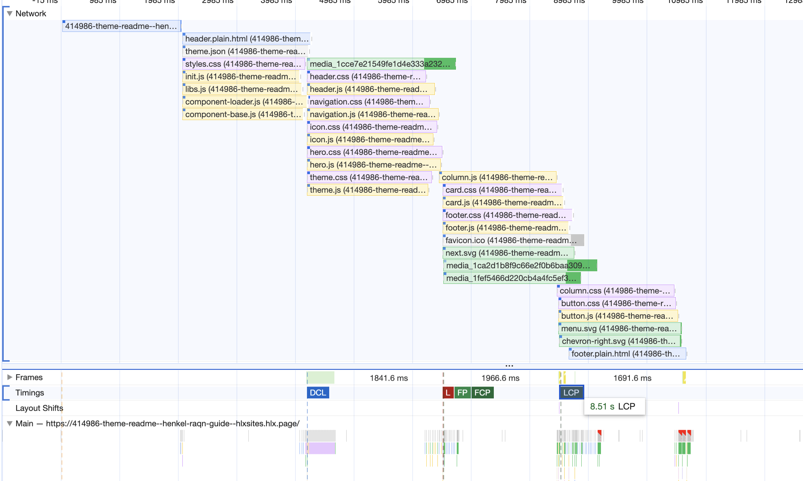
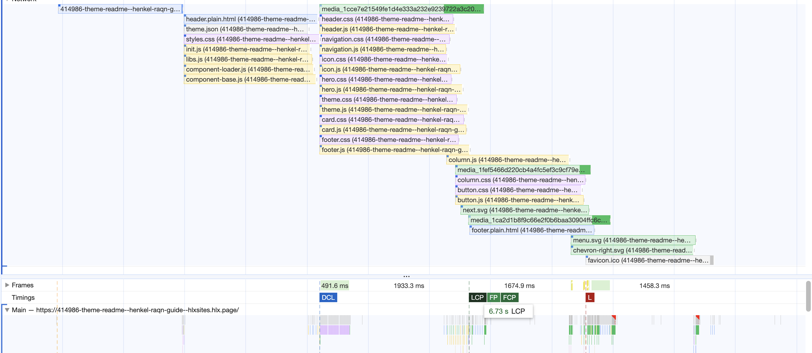
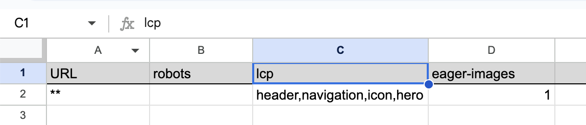
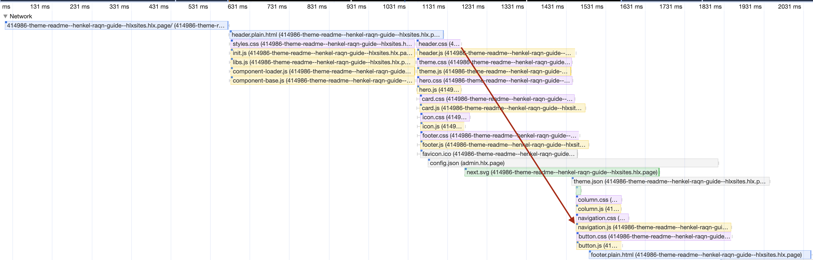
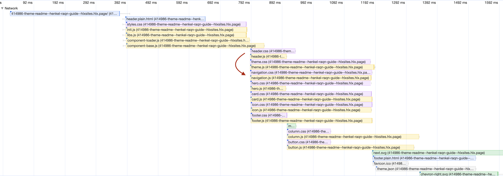
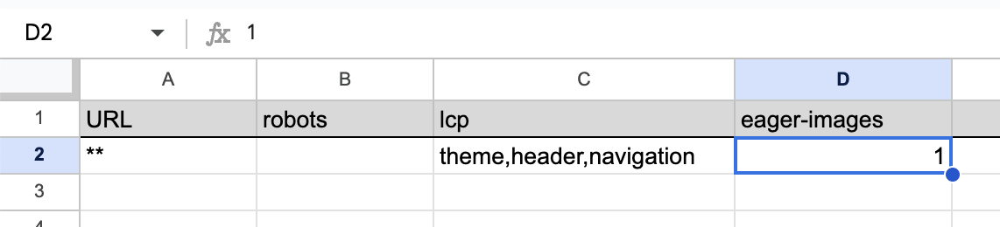
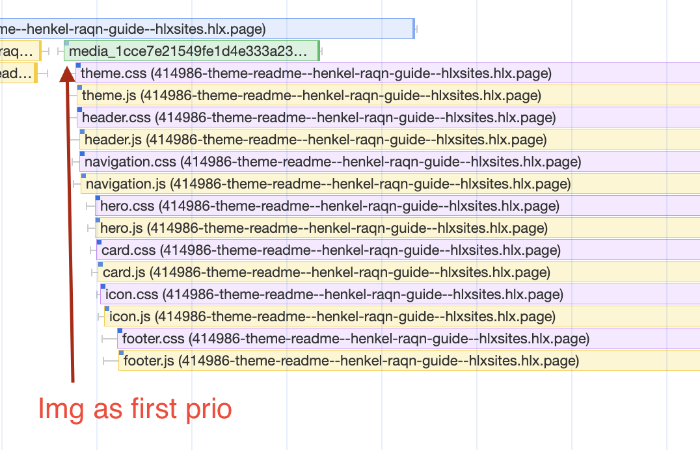

# Performance Optimization for EDS

## Edge Delivery

In our pursuit of enhancing overall performance on EDS, we focus on optimizing Edge Delivery scripts. The guiding principles are as follows:

1. **Eager Loading:** Prioritize critical files such as `main files`, `style.css`, and `script.js`.
2. **Lazy Loading:** Queue secondary priority items.
3. **Delay Loading:** Postpone non-essential code execution.

Explore more details [here](../edge/performance.md).

## Assumptions

As highlighted in [Keeping It 100, Web Performance](https://www.aem.live/developer/keeping-it-100#three-phase-loading-e-l-d):

> "It is a good rule of thumb to keep the aggregate payload before the LCP below 100kb, resulting in an LCP event quicker than 1560ms (LCP scoring at 100 in PSI). Especially on mobile, the network tends to be bandwidth constrained, so changing the loading sequence before LCP has minimal to no impact."

This underscores the significance of adhering to a performance budget and how queuing influences it.

# OOB Implementation Queue

In line with the performance budget, we default to minimizing assets and scripts in the main priority. However, indiscriminate queuing can negate the benefits of concurrency and other optimizations.

### Default Bootstrap Script

The impact of queuing during page load is evident here, where multiple assets queue before FCP and LCP, leading to conflicts, delays, and potential CLS issues.

Queuing's impact becomes more pronounced on a slow network.

## Checking Concurrency and Delaying

Examining three key hypotheses:

1. Concurrency yields better results.
2. Resolving Load and DOMContentLoaded conflicts is beneficial.
3. Concurrency with the three-phase approach improves performance.

Explore additional examples in [EDS performance](../edge/performance.md).

## Concurrency, Load, and Keeping Three Phases

Improving performance by leveraging concurrency, optimizing load, and retaining the three-phase structure.

Notable improvements include reduced overall load times and LCP, especially on slow networks.

## Concurrency, Load, and Removing Three Phases

Prioritizing loading without enforcing delays, focusing on LCP components, and allowing other items to load concurrently.

Significant performance gains, particularly with enhanced concurrency and correct firing of DOMContentLoaded and Load events.

# Conclusion

Opting for regular prioritization and concurrency loading yields superior gains, aligning with the established performance budget guideline.

## Further Improvements

- **Editorial Control Over LCP (Largest Contentful Paint):** Empowering editors to specify components for LCP on each page.
- **Selective Eager Loading of Images:** Providing the ability to load images eagerly based on editorial preferences and performance considerations.

# Editorial Control Over LCP

Given the diverse templates and components on pages, editorial control over LCP becomes crucial.

1. Select the number of images to prioritize.
2. Define components to prioritize for LCP.

## Metadata for LCP and Eager Images

Define LCP components and eager-loading images in metadata.

1. **lcp:** Comma-separated component/block names.
2. **eager-images:** Number of images for eager loading.

## Defining LCP Components

Without defining LCP, components load in order of appearance.

After setting up LCP order (`theme, header, navigation`):

Now you can:

1. Establish the order of loading.
2. Prioritize components for loading as priority 1.

## Defining Eager Images

Introducing eager loading for the first hero image using metadata.

Preview of the result:

