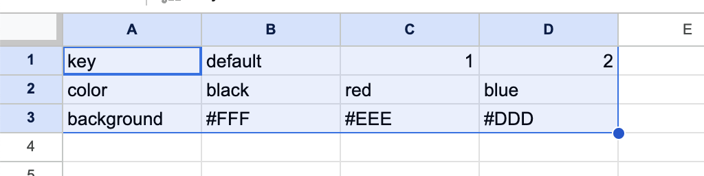
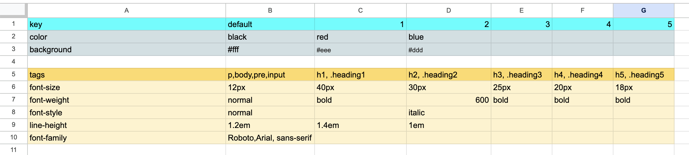
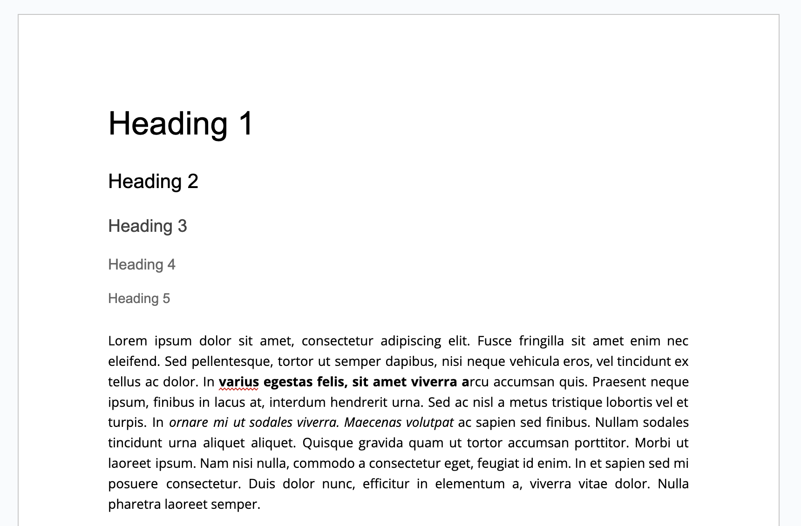
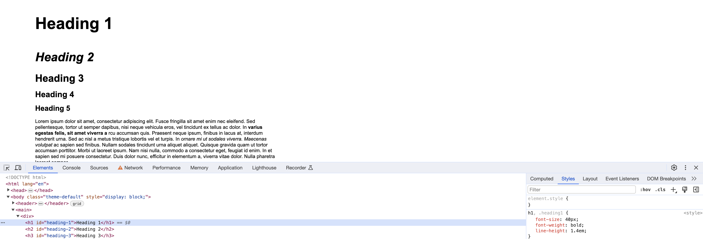
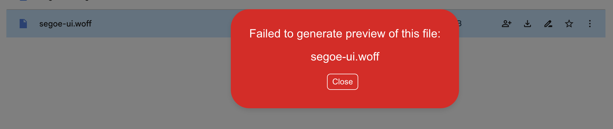

# Theming

For better future developments we want to create some theme capabilities under EDS enviroment
This means that an author could:

1. __Change layout__
2. __Change colors__
3. __Change icons__
4. __Change Fonts definitions__


## CSS variables for theme

Based on the EDS cababilities of delivering a spreadsheet as json,
we'll use a theme.xls as a theme storage.

So let's take a look at this example:



Let's take a look

- First row define name of the theme, can be used as strings like primary secondary or numbers, althoult numbers are smaller and easier to use. __(the A1 cell ilustrative and it's value is ignored)__
- The first column defines the property / variable name you want to use.

So for a nice theme application well need:
 - global css variables
 - Atomic classes for styling components or blocks
 - full theme classes to apply all properties


So the theme component will render those as 

Basic rule would be:

```javascript 

${property}-${columnName}: ${value};

```

```css
/* global css variables */
body {
    --raqn-color-1: red;
    --raqn-color-2: blue;
    --raqn-color-default: black;
    --raqn-background-1: #eee;
    --raqn-background-2: #ddd;
    --raqn-background-default: #fff;
}
/* Atomic classes with specificity of 2 */
body .color-1 {
    --scope-color: var(--raqn-color-1);
}
body .color-2 {
    --scope-color: var(--raqn-color-2);
}
body .color-default {
    --scope-color: var(--raqn-color-default);
}
body .background-1 {
    --scope-background: var(--raqn-background-1);
}
body .background-2 {
    --scope-background: var(--raqn-background-2);
}
body .background-default {
    --scope-background: var(--raqn-background-default);
}
/* them classes to apply all scopes */
.theme-1 {
    --scope-color: var(--raqn-color-1);
    --scope-background: var(--raqn-background-1);
}
.theme-2 {
    --scope-color: var(--raqn-color-2);
    --scope-background: var(--raqn-background-2);
}
.theme-default {
    --scope-color: var(--raqn-color-default);
    --scope-background: var(--raqn-background-default);
}
```

## font tags 
So for defining default font sizes and other properties we also have a second column

Main diference is that we need fonts to be defined independent of theme and to simplyfy 



rule would be 
```javascript
${tags} {
    // allowed properties: 'font-size', 'font-weight', 'font-family', 'line-height', 'font-style'
    ${property}: ${value};
}
```
Output in css 
```css
h1, .heading1 {
    font-size: 40px;
    font-weight: bold;
    line-height: 1.4em;
}
h2, .heading2 {
    font-size: 30px;
    font-weight: 600;
    line-height: 1em;
    font-style: italic;
}
h3, .heading3 {
    font-size: 25px;
    font-weight: bold;
}
h4, .heading4 {
    font-size: 20px;
    font-weight: bold;
}
h5, .heading5 {
    font-size: 18px;
    font-weight: bold;
}
p,body,pre,input {
    font-size: 12px;
    font-weight: normal;
    font-family: Roboto,Arial, sans-serif;
    line-height: 1.2em;
    font-style: normal;
}
```
## fonts example

With the theme defined above let's check the application
Document

Output



## default theme

The __theme and fonts__ are apply by default to the site

```HTML
<body class="theme-default">
<!-- ... -->
</body>
```


## Adiconal variables 

You can setup any variables to use as atomic classes but let's create some for general purposes

General purpuse variables
1. __Colors Variables__
    1. __background__: Change general background __
    2. __inner-background__: Change a child element background, ex cards background__
    3. __link-color__:
    4. __link-color-hover__:
    5. __accent-color__:
    6. __accent-background__:
    7. __accent-color-hover__:
    8. __accent-background-hover__:
    9. __header-background__:
    10. __header-color__:
    11. __headings-color__:
    12. __footer-background__:
2. __Block Model__:
    1. __max-width__:
    2. __padding__
    3. __inner-padding__
    4. __gap__
    5. __margin__
    6. __icon-size__
3. __Aligment__
    1. __align__
    2. __justify__
    

## applying theme

Lets try 


## Limitations

We also develop a font-face theme definition, but currently EDGE delivery lacks the cabability of maintaining fonts in drive or serving it.

